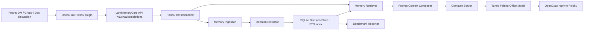

# Memory 定义与架构白皮书

## 方向选择

本交付选择方向 B：飞书项目决策与上下文记忆。

企业场景中的有效记忆不是简单保留完整聊天历史，而是把会影响后续执行的项目事实沉淀为可检索、可覆盖、可审计的结构化记录。本实现把以下内容定义为项目决策记忆：

- 已确认的方案、基线、接口、运行方式和截止时间
- 决策理由、反对意见和最终结论
- 决策所属的租户、项目、会话、主题和来源证据
- 后续更正、废弃或覆盖产生的版本关系

当前版本不实现 CLI 高频命令、个人偏好和遗忘提醒。团队决策只存放在 LarkMemoryCore 服务端 SQLite 数据库中，不写入 OpenClaw 私人记忆文件。

## 架构



实现位置：

- `api_server/services/memory_service.py`：记忆提取、存储、检索、版本覆盖、prompt 组合
- `api_server/routers/memory.py`：`/v1/memory/events`、`/v1/memory/search`、`/v1/memory/report`
- `api_server/routers/inference.py`：在 chat prompt 进入 compute 前注入历史决策卡片
- `api_server/schemas/memory.py`：公开请求和响应结构

记忆模块默认关闭：

```bash
LARK_MEMORY_CORE_MEMORY_ENGINE_ENABLED=0
```

竞赛演示时开启：

```bash
export LARK_MEMORY_CORE_MEMORY_ENGINE_ENABLED=1
export LARK_MEMORY_CORE_MEMORY_DB_PATH=.run/memory-engine/decision_memory.sqlite3
export LARK_MEMORY_CORE_MEMORY_MAX_CARDS=3
```

## 数据流

1. OpenClaw 把飞书 DM、群聊 `@bot` 或文档片段转成 OpenAI 兼容请求。
2. LarkMemoryCore API 复用现有 OpenClaw/飞书 envelope 清洗逻辑，得到真实用户文本。
3. Memory Gateway 从 raw request 中解析 `conversation_id`、`sender_id`、项目和租户元数据。
4. Decision Extractor 识别“决定、确认、统一使用、行为基线、更新、废弃、不再、request_timeout_ms”等决策信号。
5. Decision Store 写入 `memory_events` 和 `decision_memories`，并维护 SQLite FTS 索引。
6. 同一租户、项目、会话、主题下的冲突决策按 `occurred_at` 重算版本链；时间最新的版本标记为 `active`，较旧版本标记为 `superseded`。如果旧事件迟到写入，不会覆盖已经生效的新决策。
7. Retriever 只返回 `active` 记忆，并按关键词、主题命中、会话范围、版本新鲜度排序。
8. Prompt Composer 将最多 3 张历史决策卡片注入最终 prompt，并返回 `X-LarkMemoryCore-Memory-Hit-Count` 与 `X-LarkMemoryCore-Memory-Ids`。

## 存储模型

`memory_events` 保存原始证据：

- source
- tenant_id
- project_id
- conversation_id
- sender_id
- occurred_at
- raw_text
- clean_text
- metadata_json
- event_hash

`decision_memories` 保存结构化决策：

- memory_key
- topic
- decision
- reason
- objections
- conclusion
- status
- version
- source_event_id
- source_url
- supersedes_id

`retrieval_logs` 保存评测和审计指标：

- request_id
- query_hash
- hit_count
- top_memory_id
- injected_chars
- retrieval_latency_ms
- used_for_prompt

## 企业价值

该记忆引擎解决的是“团队已决事项在后续讨论中被遗忘”的问题。相比把整段聊天历史交给模型，它有三个优势：

- 可审计：每张决策卡保留来源事件和来源 URL。
- 可更新：冲突决策按时序覆盖，只把 active 版本用于检索。
- 可量化：命中率、版本正确率、检索耗时、节省字符数都进入报告。

在现有 OpenClaw + Feishu + LarkMemoryCore 栈中，该能力不改变 compute server 协议，也不新增飞书专用入口。它只增强 API 层的上下文构造，因此可以和现有模型、真实数据集、验收脚本一起运行。
